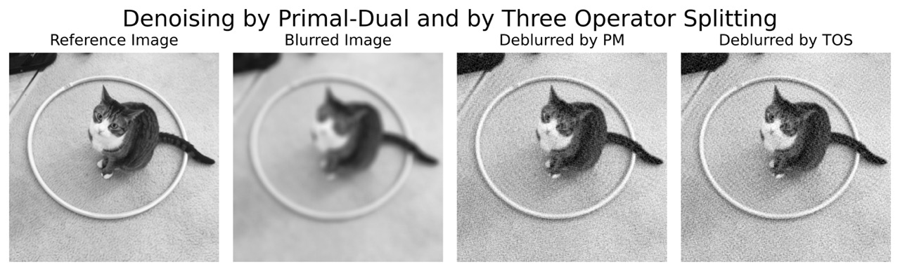

# Image Deblurring based on the ROF Model using a Primal-Dual and a Three Operator Splitting Method

The aim of this project is to deblur images according to the Model suggested by Rudin, Osher and Fatemi. We focus on a Primal-Dual method suggested by Chomboll and Pock (2010) and on a Three Operator Splitting Method suggested by Davis and Yin (2017).
    

